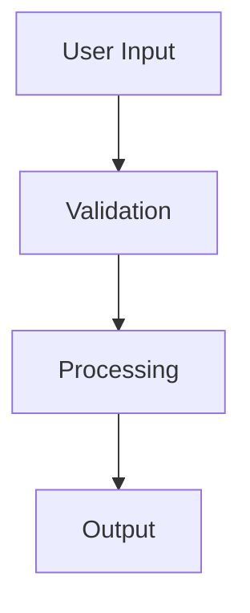
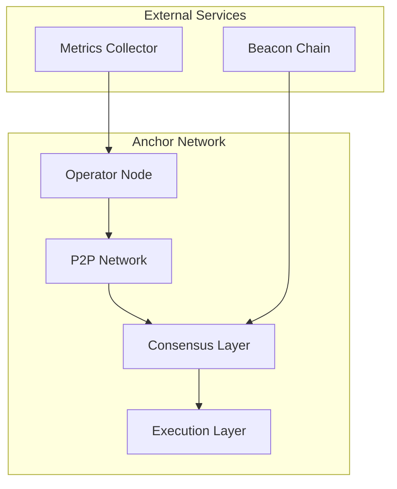
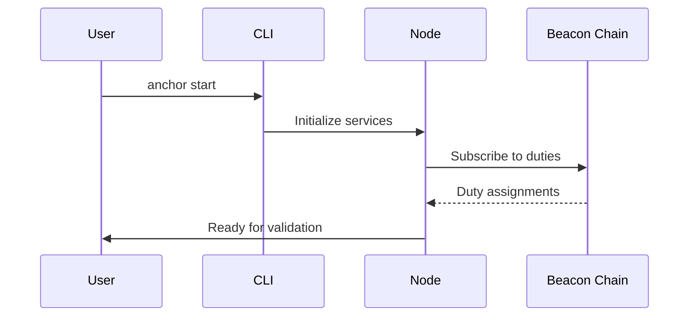

# Anchor Book - Usage Examples

## Development Workflow Examples

### Local Development Setup

```bash
# Install mdBook
cargo install mdbook mdbook-mermaid

# Clone and navigate to book directory
cd anchor/book

# Start development server with live reload
mdbook serve --open
# Opens browser at http://localhost:3000 with auto-refresh on file changes
```

### Content Creation Workflow

```bash
# Add new documentation page
touch src/new_feature.md

# Update table of contents
echo "- [New Feature](./new_feature.md)" >> src/SUMMARY.md

# Write content with Mermaid diagram
cat > src/new_feature.md << 'EOF'
# New Feature

This feature provides enhanced functionality.



## Implementation Details
...
EOF

# Test changes locally
mdbook serve
```

## Content Organization Examples

### Markdown Structure Example

```markdown
# Chapter Title

Brief introduction to the topic.

## Section Overview

### Subsection Details

Code example with syntax highlighting:

```rust
fn example_function() -> Result<(), Error> {
    println!("Example implementation");
    Ok(())
}
```

### Configuration Example

```toml
[section]
option = "value"
numeric_option = 42
```

## Common Tasks

Related topics: [Installation](./installation.md), [CLI Reference](./cli.md)
```

### Cross-Reference Patterns

```markdown
<!-- Internal links -->
See the [Architecture Overview](./architecture.md#system-design) for details.

<!-- Code references with line numbers -->
The main configuration is defined in `book.toml:8-11`.

<!-- External links -->
Refer to the [mdBook documentation](https://rust-lang.github.io/mdBook/) for advanced features.
```

## Diagram Integration Examples

### Network Architecture Diagram



### Process Flow Diagram



## Build and Deployment Examples

### Automated Build Pipeline

```yaml
# .github/workflows/book.yml
name: Build Book
on:
  push:
    paths: ['book/**']

jobs:
  build:
    runs-on: ubuntu-latest
    steps:
      - uses: actions/checkout@v3
      - name: Setup mdBook
        run: |
          cargo install mdbook mdbook-mermaid
      - name: Build book
        run: |
          cd book
          mdbook build
      - name: Deploy to GitHub Pages
        uses: peaceiris/actions-gh-pages@v3
        with:
          github_token: ${{ secrets.GITHUB_TOKEN }}
          publish_dir: ./book/book
```

### Custom CSS Integration

```css
/* src/css/custom.css */
.warning {
    background: #fff3cd;
    border: 1px solid #ffeaa7;
    border-radius: 4px;
    padding: 1rem;
    margin: 1rem 0;
}

.code-example {
    background: #2d3748;
    color: #e2e8f0;
    padding: 1rem;
    border-radius: 8px;
    overflow-x: auto;
}
```

## Testing and Validation Examples

### Link Validation Script

```bash
#!/bin/bash
# validate_links.sh

# Build the book
mdbook build

# Check for broken internal links
find book -name "*.html" -exec grep -l "href.*\.md" {} \; | while read file; do
    echo "Warning: Markdown link found in HTML: $file"
done

# Validate external links (requires linkchecker)
linkchecker book/index.html --check-extern
```

### Content Review Checklist

```markdown
- [ ] All code examples compile and run correctly
- [ ] Internal links resolve to existing pages
- [ ] External links are accessible and relevant
- [ ] Mermaid diagrams render properly
- [ ] Spelling and grammar are correct
- [ ] Content follows style guide conventions
- [ ] Mobile responsiveness is maintained
- [ ] Search functionality includes new content
```

## Maintenance Examples

### Content Update Workflow

```bash
# Regular maintenance tasks

# Update dependencies
cargo install --force mdbook mdbook-mermaid

# Validate all links
./scripts/validate_links.sh

# Check for outdated content
grep -r "TODO\|FIXME\|DEPRECATED" src/

# Update version references
sed -i 's/v1\.2\.3/v1.2.4/g' src/*.md

# Rebuild and test
mdbook build && mdbook serve
```

### Performance Optimization

```javascript
// Custom search enhancement
document.addEventListener('DOMContentLoaded', function() {
    // Lazy load images
    const images = document.querySelectorAll('img[data-src]');
    const imageObserver = new IntersectionObserver((entries, observer) => {
        entries.forEach(entry => {
            if (entry.isIntersecting) {
                const img = entry.target;
                img.src = img.dataset.src;
                img.classList.remove('lazy');
                observer.unobserve(img);
            }
        });
    });
    
    images.forEach(img => imageObserver.observe(img));
});
```

These examples demonstrate common patterns and workflows for maintaining and extending the Anchor Book documentation component.