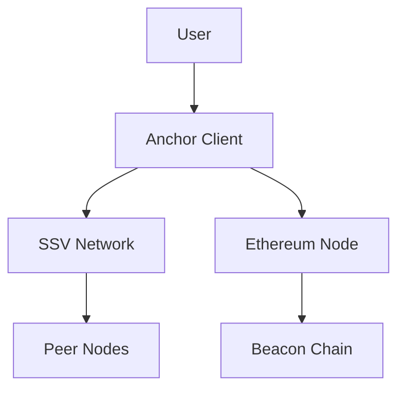
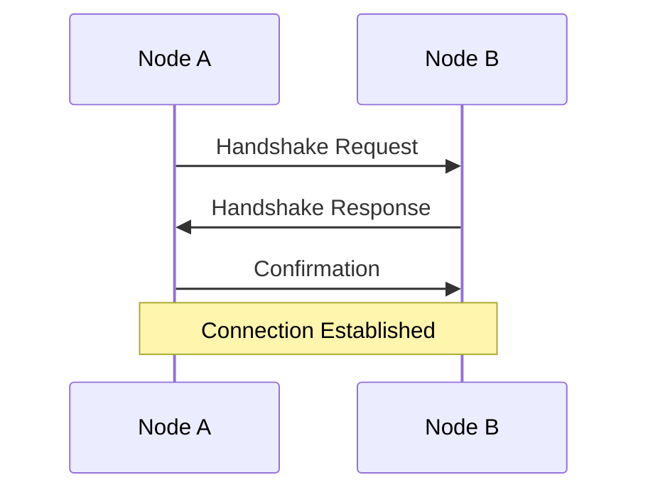

# Anchor Book - Usage Examples

## Building and Serving the Documentation

### Basic Development Workflow

**Install mdBook**:
```bash
cargo install mdbook
```

**Install Mermaid Preprocessor**:
```bash
cargo install mdbook-mermaid
```

**Serve Documentation Locally**:
```bash
# Navigate to book directory
cd /path/to/anchor/book

# Serve with auto-reload and browser opening
mdbook serve --open

# Serve on specific port
mdbook serve --port 3001
```

**Build Static Documentation**:
```bash
# Build to book/ directory
mdbook build

# Build to custom output directory
mdbook build --dest-dir /path/to/output
```

## Content Development Examples

### Adding a New Documentation Page

**1. Create Markdown File**:
```bash
# Create new documentation file
touch src/new_feature.md
```

**2. Add Content**:
```markdown
# New Feature Documentation

## Overview
Description of the new feature...

## Usage
```rust
// Code example
use anchor_client::NewFeature;
```

## Configuration
- Parameter 1: Description
- Parameter 2: Description
```

**3. Update Table of Contents**:
```markdown
# Summary

- [Introduction](./intro.md)
- [Installation](./installation.md)
- [New Feature](./new_feature.md)  # Add here
- [Running an Operator](./running_node.md)
```

### Adding Mermaid Diagrams

**Architecture Diagram Example**:
```markdown
## System Architecture



**Sequence Diagram Example**:
```markdown
## Handshake Process


```

### Custom Styling

**Adding Custom CSS**:
```css
/* src/css/custom.css */
.highlight-box {
    background-color: #f0f0f0;
    border-left: 4px solid #007acc;
    padding: 1em;
    margin: 1em 0;
}

.code-example {
    background-color: #2d3748;
    color: #e2e8f0;
    padding: 1em;
    border-radius: 0.375rem;
}
```

**Using Custom Styles in Markdown**:
```html
<div class="highlight-box">
<strong>Important:</strong> This configuration requires careful attention to security settings.
</div>
```

## Configuration Examples

### Custom Book Configuration

**Enhanced book.toml**:
```toml
[book]
language = "en"
multilingual = false
src = "src"
title = "Anchor Book - Enhanced"
description = "Comprehensive Anchor SSV Client Documentation"
author = "Sigma Prime"

[build]
build-dir = "book"
create-missing = true

[output.html]
additional-css = [
    "src/css/custom.css",
    "src/css/syntax-highlighting.css"
]
default-theme = "coal"
preferred-dark-theme = "navy"
additional-js = [
    "mermaid.min.js", 
    "mermaid-init.js",
    "src/js/custom.js"
]
site-url = "https://anchor-book.sigmaprime.io"
git-repository-url = "https://github.com/sigp/anchor"

[preprocessor.mermaid]
command = "mdbook-mermaid"

[preprocessor.links]
```

### Advanced Mermaid Configuration

**Custom Mermaid Initialization**:
```javascript
// mermaid-init.js
mermaid.initialize({
    theme: 'dark',
    themeVariables: {
        primaryColor: '#007acc',
        primaryTextColor: '#ffffff',
        primaryBorderColor: '#004c80',
        lineColor: '#cccccc'
    },
    flowchart: {
        curve: 'basis',
        padding: 20
    },
    sequence: {
        diagramMarginX: 50,
        diagramMarginY: 10,
        actorMargin: 50,
        width: 150,
        height: 65,
        boxMargin: 10,
        boxTextMargin: 5,
        noteMargin: 10,
        messageMargin: 35
    }
});
```

## Development Workflow Examples

### Live Development Setup

**Development Script**:
```bash
#!/bin/bash
# dev-serve.sh

# Check if mdbook is installed
if ! command -v mdbook &> /dev/null; then
    echo "Installing mdbook..."
    cargo install mdbook mdbook-mermaid
fi

# Navigate to book directory
cd "$(dirname "$0")"

# Start development server
echo "Starting development server..."
mdbook serve --hostname 0.0.0.0 --port 3000 --open
```

**Watch and Build Script**:
```bash
#!/bin/bash
# watch-build.sh

# Build once initially
mdbook build

# Watch for changes and rebuild
fswatch -o src/ | while read f; do
    echo "Changes detected, rebuilding..."
    mdbook build
    echo "Build complete at $(date)"
done
```

### Content Validation

**Link Checking**:
```bash
# Install link checker
cargo install mdbook-linkcheck

# Add to book.toml
[preprocessor.links]

# Run link validation
mdbook build
```

**Spell Checking Integration**:
```bash
# Check spelling in markdown files
find src/ -name "*.md" -exec aspell check {} \;

# Or use automated spell check
find src/ -name "*.md" -exec aspell list < {} \; | sort | uniq
```

## Production Deployment Examples

### CI/CD Pipeline Configuration

**GitHub Actions Example**:
```yaml
name: Build and Deploy Documentation

on:
  push:
    branches: [ main, unstable ]
    paths: [ 'book/**' ]

jobs:
  build-and-deploy:
    runs-on: ubuntu-latest
    steps:
    - uses: actions/checkout@v3
    
    - name: Setup Rust
      uses: actions-rs/toolchain@v1
      with:
        toolchain: stable
    
    - name: Install mdBook
      run: |
        cargo install mdbook mdbook-mermaid
    
    - name: Build book
      run: |
        cd book
        mdbook build
    
    - name: Deploy to GitHub Pages
      uses: peaceiris/actions-gh-pages@v3
      with:
        github_token: ${{ secrets.GITHUB_TOKEN }}
        publish_dir: ./book/book
```

### Docker Deployment

**Dockerfile for Documentation**:
```dockerfile
FROM rust:latest as builder

# Install mdbook and preprocessors
RUN cargo install mdbook mdbook-mermaid

# Copy source
COPY book/ /book/
WORKDIR /book

# Build documentation
RUN mdbook build

# Production image with nginx
FROM nginx:alpine
COPY --from=builder /book/book /usr/share/nginx/html
COPY nginx.conf /etc/nginx/nginx.conf

EXPOSE 80
```

**Docker Compose Example**:
```yaml
version: '3.8'
services:
  anchor-docs:
    build: .
    ports:
      - "8080:80"
    volumes:
      - ./nginx.conf:/etc/nginx/nginx.conf:ro
    restart: unless-stopped
```

These examples demonstrate comprehensive usage patterns for the Anchor Book documentation system, from basic development workflows to advanced deployment configurations.