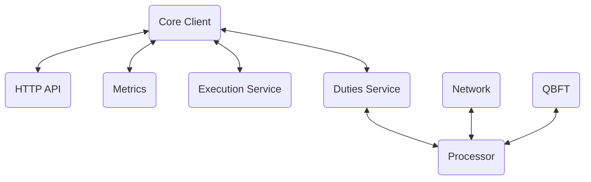
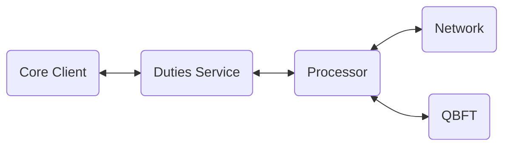

# Architectural Overview

This section provides developers an overview of the architectural design of Anchor. The intent of this
is to help gain an easy understanding of the client and associated code.

## Thread Model

Anchor is a multi-threaded client. There are a number of long standing tasks that are spawned when
Anchor is initialised. This section lists these high-level tasks and describes their purpose along
with how they are connected.

### Task Overview

The following diagram gives a basic overview of the core tasks inside Anchor.

The boxes here represent stand alone tasks, with the arrows representing channels between these
tasks. Memory is often shared between these tasks, but this is to give an overview of how the client
is pieced together.

The tasks are:

- **HTTP API** - A HTTP endpoint to read data from the client, or modify specific components.
- **Metrics** - Another HTTP endpoint designed to be scraped by a Prometheus instance. This provides
    real-time metrics of the client.
- **Execution Service** - A service used to sync SSV information from the execution layer nodes.
- **Duties Service** - A service used to watch the beacon chain for validator duties for our known
    SSV validator shares.
- **Network** - The p2p network stack (libp2p) that sends/receives data on the SSV p2p network.
- **Processor** - A middleware that handles CPU intensive tasks and prioritises the workload of the
    client.
- **QBFT** - Spawns a QBFT instance and drives it to completion in order to reach consensus in an
    SSV committee.

### General Event Flow

Generally, tasks can operate independently from the core client. The main task that drives the
Anchor client is the duties service. It specifies when and what kind of validator duty we must be
doing at any given time.

Once a specific duty is assigned, a message is sent to the processor to start one (or many) QBFT instances for
this specific duty or duties. Simultaneously, we are awaiting messages on the network service. As
messages are received they are routed to the processor, validation is performed and then they are
routed to the appropriate QBFT instance.

Once we have reached consensus, messages are sent (via the processor) to the network to sign our
required duty.

A summary of this process is:

1. Await a duty from the duties service
1. Send the duty to the processor
1. The processor spins up a QBFT instance
1. Receive messages until the QBFT instance completes
1. Sign required consensus message
1. Publish the message on the p2p network.

An overview of how these threads are linked together is given below:

